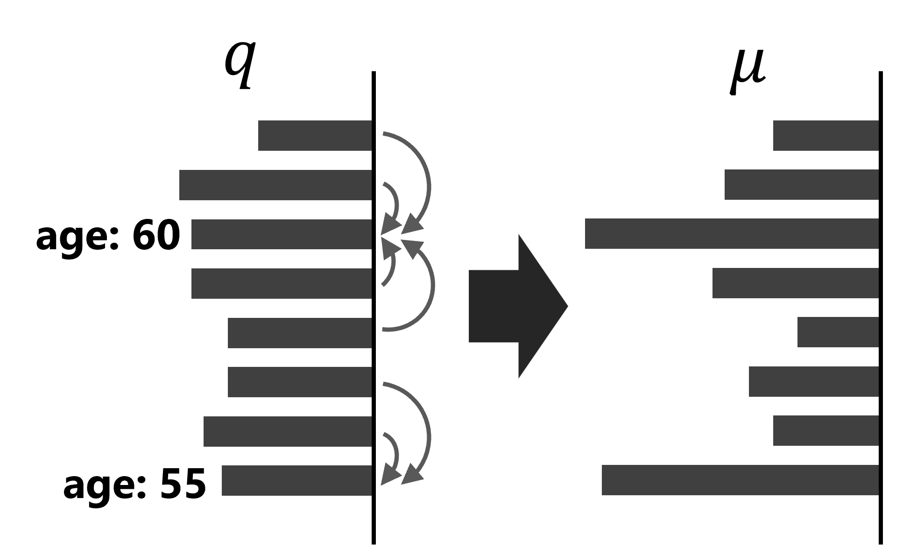
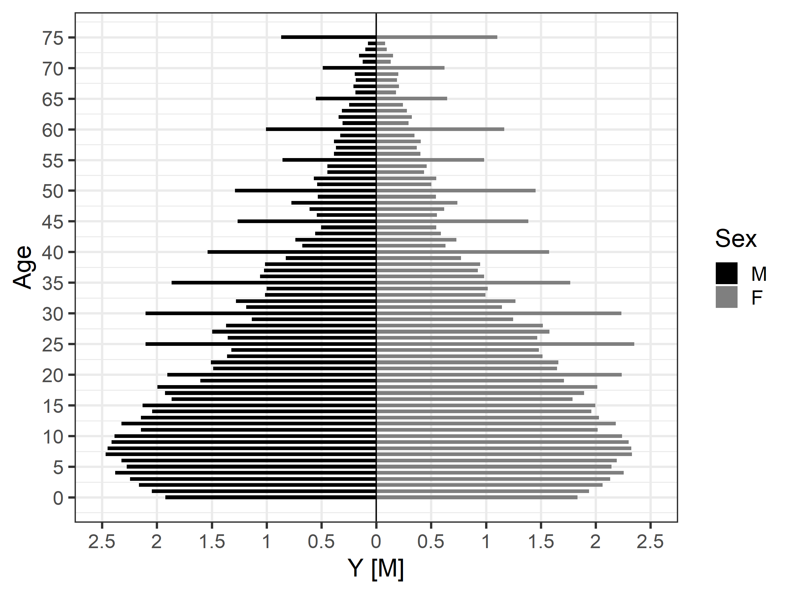

| page | line | before | after |
|:-----------|:------------|:------------|:------------|
| 62 | Lines 24 and 25 in `model4-4b.stan` | `1:N` |  `1:Np` |
| 229 | Line 5 | $\text{Bernoulli}(0 \mid q_c)$ | $\text{Bernoulli}(0 \mid q_f)$ |
| 233 | Line 26 | $Y_3 = 1 - Y_1 - Y_2$ | $Y_3 = m - Y_1 - Y_2$ |
| 292 | Fig. 12.3 |  |  |
