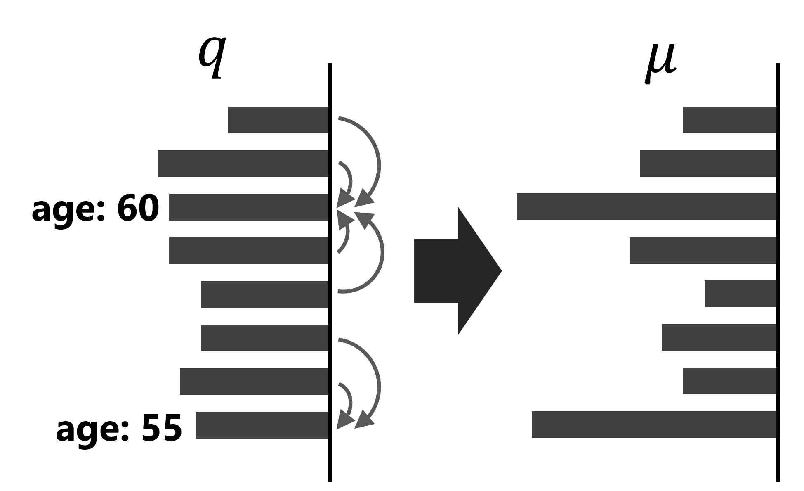
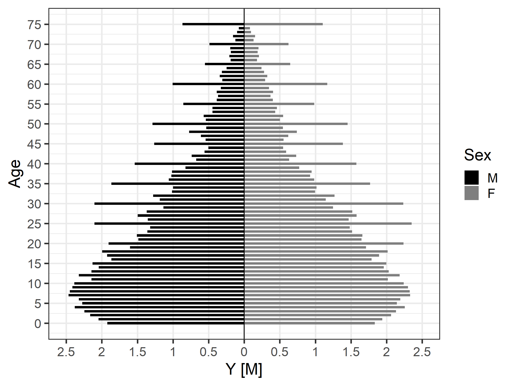

| page | line | before | after |
|:-----------|:------------|:------------|:------------|
| 9 | Lines 22 and 23 | would cause would cause | would cause |
| 33 | Paragraph 4, line 5 | discouse | discourse |
| 39 | Paragraph 4, line 3 | discouse | discourse |
| 62 | Lines 24 and 25 in `model4-4b.stan` | `1:N` |  `1:Np` |
| 187 | Paragraph 5, line 1 | representshe | represents the |
| 189 | Paragraph 3, line 3 | usi | using |
| 191 | Paragraph 1, line 5 | Inther | In other |
| 195 | Paragraph 1, line 2 | representistbutions | represent the distritbutions |
| 196 | Paragraph 3, line 5 | iltpon | ??? |
| 196 | Paragraph 3, line 6 | believthat | believe that |
| 200 | Paragraph 3, line 6 | thiprior | this prior |
| 202 | Paragraph 6, line 1 | and$\b$ | and $\b$ |
| 202 | Paragraph 6, line 3 | $\sigma_\alpha$ and $\sigma_\beta$ | $\sigma_a$ and $\sigma_b$ |
| 202 | Paragraph 6, line 4 | $\sigma_\alpha$, $\sigma_\beta$ | $\sigma_a$, $\sigma_b$ |
| 202 | Paragraph 7, line 1 | $\sigma_\alpha$ | $\sigma_a$ |
| 202 | Paragraph 7, line 2 | $\sigma_\beta$ | $\sigma_b$ |
| 216 | Paragraph 2, line 6 | therobability | the probability |
| 223 | Line 15 in code snippet | `igma` | `sigma` |
| 229 | Line 5 | $\text{Bernoulli}(0 \mid q_c)$ | $\text{Bernoulli}(0 \mid q_f)$ |
| 233 | Line 26 | $Y_3 = 1 - Y_1 - Y_2$ | $Y_3 = m - Y_1 - Y_2$ |
| 237 | Bullet point 4 | provides | provide |
| 292 | Fig. 12.3 |  |  |
| 276 | Line 3 | sunny, cloudy, rain, snow | sunny, cloudy, rain, heavy rain, snow |
| 312 | Line 32 in `model12-7b.stan` | `normal(0, 0.1)`  | `normal(0.1, 0.1)` |
| 314 | Line 11 in `model12-7c.stan` | `normal(0, 0.1)`  | `normal(0.1, 0.1)` |
| 368 | Eq. 14.25 | $\frac{q(y)}{p_\textrm{pred}(y)}$ | $\frac{q(y)}{p_\textrm{pred}(y)}dy$ |
